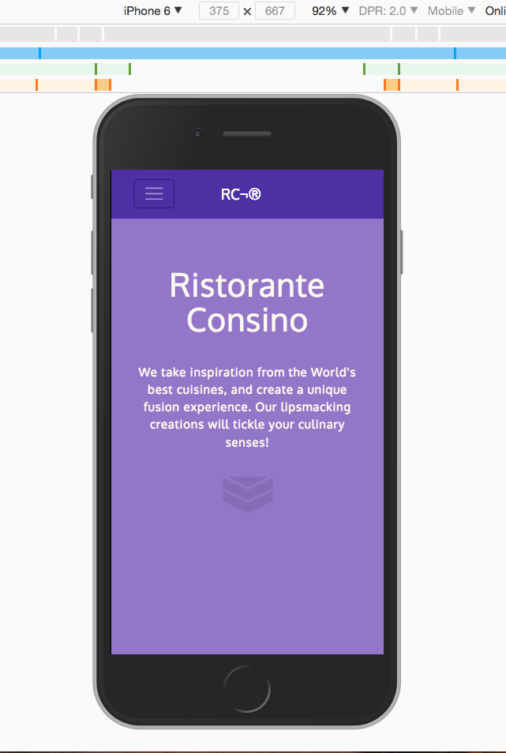
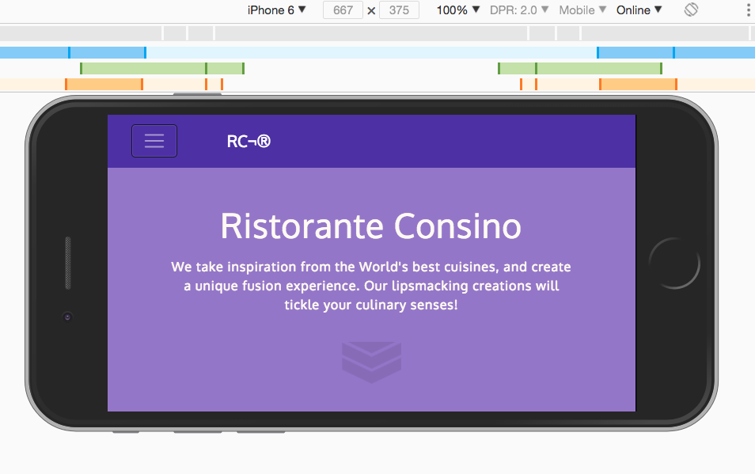

## fe ui frameworks/tools

- col-auto
  + use enough columns to accomodate content

- col, col-sm, col-md
  + use for remaining columns, once a first value already been given.

  + pull-md-3, push-md-4 (push and pull)

  + offset-1, offset-3

- flex-last, flex-first
  + allow us to reposition content - same as push and pull

  ex:
    <div class="col-sm-3 col-md-4 flex-last">...</div>

    <div class="col-sm col-md flex-first">...</div>


- ul class of "list-unstyled"
  ex:
    <ul class="list-unstyled">...</ul>


- adding `align-items-center` vertically aligns content within row


- horizontally centering the column (as oppose to the one above that vertically aligns the content)
  ex:
    <div class="row justify-content-center">
     <div class="col-auto">


- basic nav menu

```
     <!-- collapses on sm inverse is black originally -->
    <nav class="navbar navbar-inverse navbar-toggleable-sm fixed-top">
        <div class="container">
            <button class="navbar-toggler" type="button" data-toggle="collapse" data-target="#Navbar">
                <span class="navbar-toggler-icon"></span>  
            </button>
            <a class="navbar-brand" href="#">RC¨</a>
            <div class="collapse navbar-collapse" id="Navbar">
                <ul class="navbar-nav">
                    <li class="nav-item active"><a class="nav-link" href="#">Home
                    </a></li>
                    <li class="nav-item"><a class="nav-link" href="./aboutus.html">About
                    </a></li>
                    <li class="nav-item"><a class="nav-link" href="#">Menu
                    </a></li>
                    <li class="nav-item"><a class="nav-link" href="#">Contact
                    </a></li> 
                </ul> 
            </div>   
        </div> <!-- endof container -->    
    </nav>


```


> `npm start`, starts lite-server and browsersync
>
<br/>


### breadcrumb syntax

```
      <ol class="col-12 breadcrumb">
            <li class="breadcrumb-item"><a href="./index.html">Home</a></li>
            <li class="breadcrumb-item active">About Us</li>
      </ol>

```

### icon fonts

font-awesome & bootstrap social

npm install font-awesome --save
boostrap-social.css

```
    <i class="fa fa-phone"></i>

    <a class="btn btn-social-icon btn-facebook" href="http://www.facebook.php?id=">

```
> you can use either span or i for font-awesome


<kbd>nav menu</kbd>
<br/>


<kbd>screenshot two</kbd>
<br/>



> this alpha version of bootstrap throws an error 'collapse is transitioning'


      
