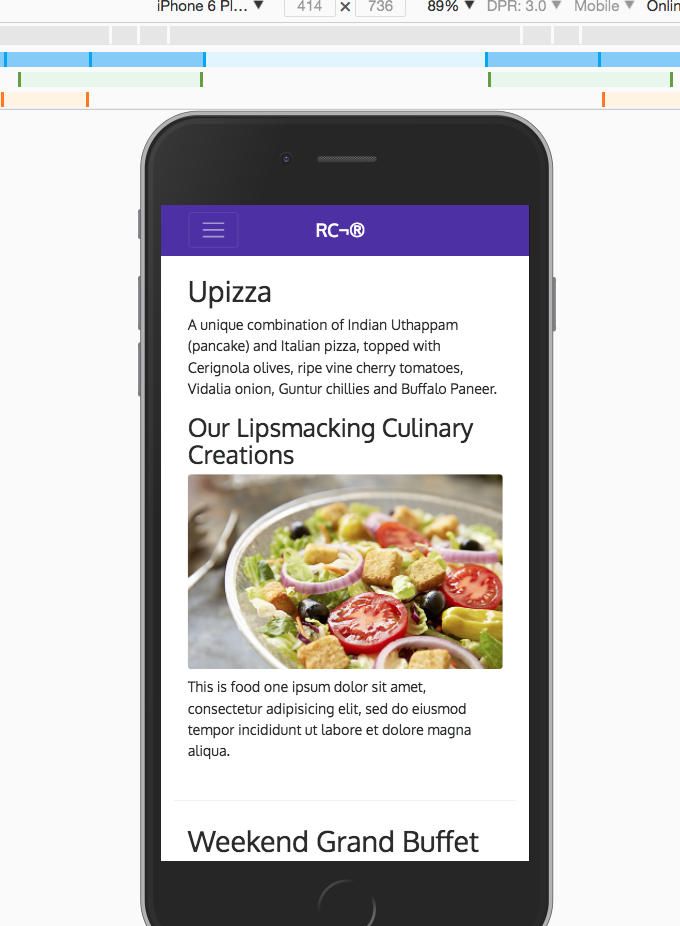

# FE Tools &nbsp; Bootstrap 4 &nbsp; :book:

## Notes &nbsp; :pencil2: &nbsp; :clipboard:
- ***col-auto***   
  + use enough columns to accomodate content - spreads up columns automatically   

- ***col*** and ***col-xx** (col-sm, col-md)   
  + col and col-xx, are used onlhy once an initial value for a col and col-xx already been set   
    * it's use for remaining columns
    * col is just how the smallest col classes are now defined in bootstrap 4

- offset-1, offset-3  (just as with previous versions boostrap)   

- ***flex-last***, ****flex-first***   
  + allows you to reposition content - in the same as with push and pull (same old pull and push classes)   

```
  ex:
  
    <div class="col-sm-3 col-md-4 flex-last">...</div>

    <div class="col-sm col-md flex-first">...</div>
```

- ul class of ***list-unstyled*** (this does the obvious)

```
  ex:
    <ul class="list-unstyled">...</ul>

```


- adding ***align-items-center*** to vertically aligns content within row


- ***horizontally centering the column*** (as oppose to the one above that vertically aligns the content)   

```
  ex:
    <div class="row justify-content-center">
     <div class="col-auto">

```


- basic ***nav menu***

```
     <!-- collapses on sm inverse is black originally -->
    <nav class="navbar navbar-inverse navbar-toggleable-sm fixed-top">
        <div class="container">
            <button class="navbar-toggler" type="button" data-toggle="collapse" data-target="#Navbar">
                <span class="navbar-toggler-icon"></span>  
            </button>
            <a class="navbar-brand" href="#">RC¨</a>
            <div class="collapse navbar-collapse" id="Navbar">
                <ul class="navbar-nav">
                    <li class="nav-item active"><a class="nav-link" href="#">Home
                    </a></li>
                    <li class="nav-item"><a class="nav-link" href="./aboutus.html">About
                    </a></li>
                    <li class="nav-item"><a class="nav-link" href="#">Menu
                    </a></li>
                    <li class="nav-item"><a class="nav-link" href="#">Contact
                    </a></li> 
                </ul> 
            </div>   
        </div> <!-- endof container -->    
    </nav>


```


> I'm using `npm start`, to start lite-server and browsersync
>
<br/>


<kbd>nav menu</kbd>
<br/>


<kbd>screenshot two</kbd>
<br/>



      
